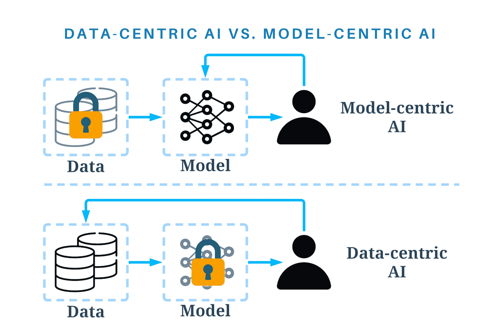

# Cuộc đua số 2023 - Thử thách: AI tập trung vào dữ liệu

Trong các bài toán thực tế, dữ liệu đóng vai trò vô cùng quan trọng trong việc xây dựng các hệ thống AI có độ chính xác cao và khả năng áp dụng thực tiễn. Nhận thức được điều này, nhiều công ty và tổ chức đã chuyển hướng phát triển AI theo hướng data-centric AI (AI tập trung vào dữ liệu), trong đó dữ liệu được coi là trung tâm và trọng tâm của quá trình xây dựng mô hình (xem thêm tại: [Data Centric AI - Landing AI](https://landing.ai/data-centric-ai/)). Trong thử thách **AI tập trung vào dữ liệu**, các đội chơi sẽ thể hiện khả năng trong việc xây dựng một bộ dữ liệu đủ tốt, đa dạng và đại diện để huấn luyện mô hình AI có độ chính xác cao cho bài toán phát hiện biển báo.



**Data-centric AI vs. model-centric AI - Hình ảnh từ [towardsdatascience](https://towardsdatascience.com/what-are-the-data-centric-ai-concepts-behind-gpt-models-a590071bb727).**

**Mã nguồn và cách đánh giá**

Mã nguồn và các siêu tham số của mô hình sẽ được cung cấp sẵn và cố định. Điều này đảm bảo các đội chơi có cùng một công cụ để huấn luyện và đánh giá mô hình. Các đội chơi sẽ phải tập trung vào việc xây dựng một bộ dữ liệu đủ tốt để huấn luyện mô hình AI có độ chính xác tốt nhất, với phần cứng hạn chế (số lượng iterations được hạn chế). Độ chính xác của mô hình AI sẽ được đánh giá trên tập dữ liệu bí mật (private test) mà các đội chơi không được tiếp xúc trước đó.

Data-centric AI đặt dữ liệu làm trọng tâm bởi vì một mô hình AI chỉ có thể hiểu và học từ những gì nó đã thấy. Để có một hệ thống AI chính xác, chúng ta cần xây dựng một tập dữ liệu phát hiện biển báo đa dạng, đại diện cho các tình huống thực tế và có khả năng tổng quát hóa. Các đội chơi sẽ phải đối mặt với các thách thức như thu thập dữ liệu, tiền xử lý và gán nhãn để tạo ra một tập dữ liệu chất lượng cao.

## 0. Cài đặt môi trường thử nghiệm

Các đội chơi có thể sử dụng môi trường local, Google Colab, hoặc Kaggle Notebook để thử nghiệm và nộp kết quả. Tuy nhiên, các đội chơi cần đảm bảo môi trường thử nghiệm có đủ các thư viện và phiên bản như sau:

- Python 3 (khuyến nghị Python 3.9).
- PyTorch 2.0.1.
- Các đội chơi sử dụng Windows cần tải và sử dụng [Git Bash](https://git-scm.com/downloads).

Ở môi trường local, các đội chơi sử dụng [Anaconda](https://docs.conda.io/en/latest/miniconda.html)/[Miniconda](https://docs.conda.io/en/latest/miniconda.html) để thiết lập môi trường. Sau khi cài Conda, để tạo môi trường thử nghiệm với tên `tfs`, các đội chơi chạy lệnh sau:

```shell
conda create -n tfs python=3.9 -y
```

Sau khi tạo môi trường, các đội chơi cần kích hoạt môi trường `tfs` bằng lệnh:

```shell
conda activate tfs
```

Clone mã nguồn và cài đặt các gói cần thiết:

```shell
git clone https://github.com/makerviet/tfs-data-centric
cd tfs-data-centric
conda activate tfs
pip install torch==2.0.1
pip install -e .
```

## 1. Mã nguồn huấn luyện và dữ liệu mẫu

### 1.1. Mã nguồn huấn luyện

Mã nguồn huấn luyện được phát triển từ mã nguồn của YOLOX, với mô hình YOLOX Nano. Các đội chơi **chỉ sử dụng mã nguồn có sẵn, không tinh chỉnh kiến trúc mô hình, các siêu tham số của mô hình**. Các đội chơi trước khi vào vòng cuối sẽ nộp lại toàn bộ dữ liệu và kết quả cuối cùng sẽ được huấn luyện và xếp hạng trên toàn bộ dữ liệu, theo mã nguồn và các siêu tham số đã được cung cấp từ trước.

### 1.2. Dữ liệu mẫu

Để tải về dữ liệu mẫu, các đội chơi chạy lệnh sau:

```shell
bash tools/download_data.sh
```

Hoặc tải về dữ liệu mẫu tại [đây](https://github.com/makerviet/via-datasets/releases/download/v1.0/via-trafficsign-coco-20210321.zip) vàm giải nén vào thư mục `datasets/vtfs/COCO`. Sau khi chạy lệnh trên, hoặc giải nén thủ công, cấu trúc dữ liệu sẽ như sau:

```
+ datasets
    + vtfs
        + COCO
            + annotations
                - train.json
                - val.json
            + images
                - train
                    - 000001.jpg
                    - ...
                - val
                    - 000001.jpg
                    - ...
+ docs
+ exps
...
```

Tập dữ liệu mẫu là dữ liệu phát hiện biển báo cho xe tự hành mô hình, gồm 11095 ảnh đóng góp bởi 2 nhóm Goodgame và ICT, gồm 6 lớp dữ liệu biển: `stop`, `left`, `right`, `straight`, `no_left`, `no_right`. Xem thêm tại [đây](https://via.makerviet.org/vi/docs/4_resources/via-datasets-1-0/).

Tập dữ liệu đánh giá (private test) để xếp hạng các đội chơi sẽ bao gồm các dữ liệu biển báo trên đường, trong các điều kiện thời tiết khác nhau, bị che khuất, bị mờ. Tập dữ liệu đánh giá sẽ được công bố sau khi kết thúc thử thách.

## 2. Huấn luyện và đánh giá mô hình đã huấn luyện trên môi trường local

### 2.1. Huấn luyện

Xoá kết quả huấn luyện cũ (nếu có):

```shell
rm -rf YOLOX_outputs/tfs_nano
```

Các bạn cũng có thể di chuyển kết quả huấn luyện cũ vào một thư mục khác để lưu trữ, ví dụ:

```shell
mv YOLOX_outputs/tfs_nano YOLOX_outputs/tfs_nano_20230716
```

Để huấn luyện mô hình, các đội chơi chạy lệnh sau:

```shell
YOLOX_DATADIR=datasets/vtfs python3 tools/train.py
```

Thay `datasets/vtfs` bằng đường dẫn tới thư mục chứa dữ liệu của đội chơi.

### 2.2. Đánh giá

Để đánh giá mô hình, các đội chơi chạy lệnh sau:

```shell
YOLOX_WEIGHTS=YOLOX_outputs/tfs_nano/best_ckpt.pth YOLOX_DATADIR=datasets/vtfs python3 tools/eval.py --output_result="result.json"
```

Kết quả đánh giá trên môi trường local, tập validation (`val.json`) sẽ được in ra như sau:

```
Average forward time: 3.47 ms, Average NMS time: 0.40 ms, Average inference time: 3.87 ms
 Average Precision  (AP) @[ IoU=0.50:0.95 | area=   all | maxDets=100 ] = 0.244
 Average Precision  (AP) @[ IoU=0.50      | area=   all | maxDets=100 ] = 0.503
 Average Precision  (AP) @[ IoU=0.75      | area=   all | maxDets=100 ] = 0.206
 Average Precision  (AP) @[ IoU=0.50:0.95 | area= small | maxDets=100 ] = 0.214
 Average Precision  (AP) @[ IoU=0.50:0.95 | area=medium | maxDets=100 ] = 0.517
 Average Precision  (AP) @[ IoU=0.50:0.95 | area= large | maxDets=100 ] = -1.000
 Average Recall     (AR) @[ IoU=0.50:0.95 | area=   all | maxDets=  1 ] = 0.331
 Average Recall     (AR) @[ IoU=0.50:0.95 | area=   all | maxDets= 10 ] = 0.351
 Average Recall     (AR) @[ IoU=0.50:0.95 | area=   all | maxDets=100 ] = 0.351
 Average Recall     (AR) @[ IoU=0.50:0.95 | area= small | maxDets=100 ] = 0.322
 Average Recall     (AR) @[ IoU=0.50:0.95 | area=medium | maxDets=100 ] = 0.625
 Average Recall     (AR) @[ IoU=0.50:0.95 | area= large | maxDets=100 ] = -1.000
per class AP:
| class    | AP     | class   | AP     | class    | AP     |
|:---------|:-------|:--------|:-------|:---------|:-------|
| stop     | 36.417 | left    | 4.904  | right    | 21.096 |
| straight | 34.206 | no_left | 23.185 | no_right | 26.510 |
per class AR:
| class    | AR     | class   | AR     | class    | AR     |
|:---------|:-------|:--------|:-------|:---------|:-------|
| stop     | 41.921 | left    | 25.537 | right    | 34.980 |
| straight | 38.267 | no_left | 33.463 | no_right | 36.255 |

Final mAP (Average Precision (AP) @[ IoU=0.50:0.95 ]): 24.38631
```

- Kết quả đánh giá sẽ dựa trên `Final mAP (Average Precision (AP) @[ IoU=0.50:0.95 ])`, trong TH này là `24.38631`.
- Kết quả đánh giá được ghi ra tệp `result.json` trong thư mục hiện tại.

## 3. Tải lên mô hình và đánh giá trên tập dữ liệu bí mật

Sau khi hoàn thành bước đánh giá, các bạn đóng gói mô hình hiện tại và gửi lên hệ thống với lệnh:

```shell
python tools/create_submission.py --exp_dir="YOLOX_outputs/tfs_nano" --output="submissions/submission_01.zip"
```

Gửi mô hình lên hệ thống bằng cách tải lên tệp `submissions/submission_01.zip`. Sau khi tải lên, các đội chơi sẽ nhận được kết quả đánh giá trên tập dữ liệu bí mật (private test) và xếp hạng trên bảng xếp hạng.

## 4. Phương pháp xây dựng bộ dữ liệu

### 4.1. Thu thập dữ liệu ảnh

Việc thu thập dữ liệu biển báo có thể được thực hiện từ nhiều nguồn: 

- Các bộ dữ liệu có sẵn.
- Hình ảnh từ internet.
- Ảnh chụp thực tế.
- Ảnh chụp từ các xe mô hình.
- Ảnh từ các giả lập.

Các đội chơi có thể sử dụng các kĩ thuật xử lý ảnh để tăng cường dữ liệu, tham khảo thêm tại [đây](https://albumentations.ai/). Việc thu thập dữ liệu nên đảm bảo:

- Các dữ liệu thu thập được đủ đa dạng, đại diện cho các tình huống thực tế.
- Cân bằng số lượng biển báo trong các lớp dữ liệu. Điều này giúp đảm bảo độ chính xác của mô hình.

**Chú ý:** Số lượng dữ liệu trong toàn bộ tập dữ liệu không vượt quá **30.000 ảnh**.


### 4.2. Gán nhãn dữ liệu

Việc gán nhãn có thể sử dụng bất cứ công cụ nào. Chúng tôi khuyến nghị một số công cụ sau:

- [AnyLabeling](https://anylabeling.nrl.ai): Gán nhãn trực tiếp trên giao diện Desktop, hỗ trợ gán nhãn tự động với Segment Anything Model. Sau khi gán nhãn dữ liệu, sử dụng [labelme2coco](https://github.com/fcakyon/labelme2coco) để chuyển đổi sang định dạng COCO.
- [Labelme](https://github.com/wkentaro/labelme): Gán nhãn trực tiếp trên giao diện Desktop, sau đó sử dụng [labelme2coco](https://github.com/fcakyon/labelme2coco) để chuyển đổi sang định dạng COCO.
- [CVAT](https://www.cvat.ai/), [Label Studio](https://labelstud.io/): Công cụ gán nhãn trên giao diện web, hỗ trợ xuât sang định dạng COCO.

Các đội chơi có thể sử dụng các công cụ khác, tuy nhiên cần đảm bảo định dạng đầu ra là định dạng COCO, hoặc có thể chuyển đổi sang COCO để huấn luyện mô hình.


### 4.3. Chia tập dữ liệu

Sau khi gán nhãn dữ liệu, các đội chơi có thể chia dữ liệu thành 2 tập nhỏ:

- Tập huấn luyện (train): Tập dữ liệu được sử dụng để huấn luyện mô hình. Tập dữ liệu này có thể chiếm khoảng 80% tổng số dữ liệu.
- Tập đánh giá (val): Tập dữ liệu được sử dụng để đánh giá mô hình. Tập dữ liệu này có thể chiếm khoảng 20% tổng số dữ liệu.
